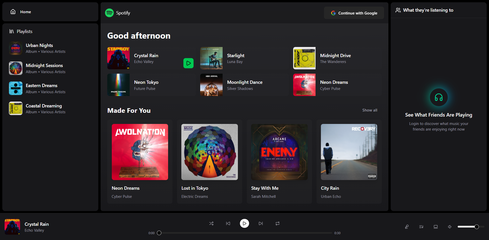

# 🎵 TuneTalk/Joblify

  

A full-stack music streaming application inspired by Spotify. This project allows users to sign up, browse songs, create playlists, and enjoy music with a sleek, responsive UI.

## 🚀 Features

- 🔐 **User Authentication** – Sign up, log in, and manage accounts securely
- 🎼 **Music Library** – Browse songs, albums, and artists
- 🔍 **Search Functionality** – Find songs instantly
- 📂 **Playlists** – Create, update, and delete playlists
- 🎛 **Music Player** – Play, pause, skip, shuffle, repeat
- 📱 **Responsive Design** – Works on desktop, tablet, and mobile
- 🌙 **Dark Mode** – User-friendly UI with theme toggle

## 🛠 Tech Stack

**Frontend**
- React.js (or Next.js)
- Tailwind CSS
- Context API / Redux
- React Router
- React Icons

**Backend**
- Node.js + Express.js
- MongoDB (with Mongoose)
- JWT Authentication
- Multer (file uploads)
- Cloudinary / AWS S3 (media storage)

**Music Playback**
- HTML5 Audio API
- HLS.js (for streaming support)
